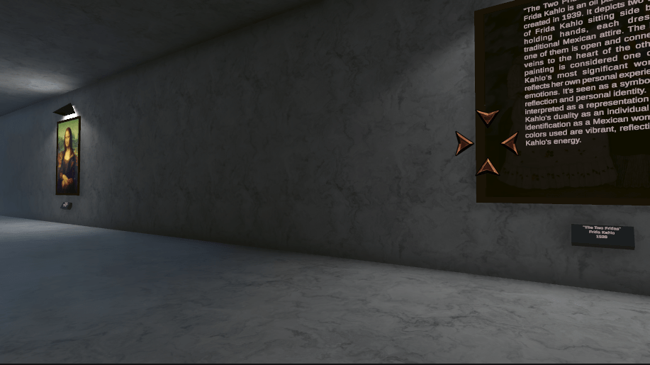

# Art Gallery

The app automatically detects whether a VR headset is connected. If so, the VR version is launched, otherwise the 3D one is.  

[Release](https://play.unity.com/mg/other/art-gallery-2)  

